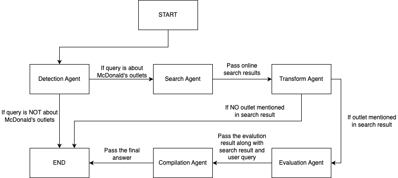

# McDonald's AI

An intelligent system that provides information about McDonald's outlets in Kuala Lumpur using agentic AI and location-based services.

You can test the app here [McDonald's AI](https://mcdonalds-ai-frontend.onrender.com/)

## Project Structure


### Technology Stack

- **Frontend**: React.js with Leaflet library for interactive mapping
- **Backend**: FastAPI for efficient API endpoints
- **Database**: AWS RDS PostgreSQL
- **Deployment**: Render for both frontend and backend services
- **AI Components**: LangChain for agentic AI implementation

### Database Schema

PostgreSQL database contains the following columns:

- `id`: Unique identifier for each outlet
- `name`: McDonald's outlet name
- `address`: Physical address
- `telephone`: Contact number
- `latitude`: Geographic latitude
- `longitude`: Geographic longitude
- `waze_link`: Direct link to Waze navigation

## Code Structure

### Frontend (`/frontend`)

- React.js application with Leaflet integration for map visualization
- Interactive map showing McDonald's outlets in KL
- Real-time AI-powered query system for outlet information

### Backend (`main.py`)

- FastAPI server implementation
- Handles database connections to AWS RDS
- Integrates with LLM components via `llm_train.py`
- Provides RESTful endpoints for:
  - Outlet information retrieval
  - AI query processing

### Data Collection (`mcdonalds_scraper.py`)

- Automated web scraping using Selenium
- Extracts outlet information from McDonald's official website
- Stores data in AWS RDS PostgreSQL

### Agentic AI Implementation (`llm_train.py`)



The system uses a multi-agent architecture using LangChain with OpenAI LLM:

1. **First Agent (Detection Agent)**

   - Validates if queries are about McDonald's outlets
   - Enhances queries with contextual information
   - Acts as a gatekeeper for the agent chain
   - Stops chain if query is not related to Mcdonald's outlet

2. **Second Agent (Search Agent)**

   - Utilizes Tavily Search tool for online information
   - Gathers real-time data about outlets
   - Provides comprehensive search results

3. **Third Agent (Transform Agent)**

   - Converts search results into database-queryable format
   - Creates structured questions for database validation
   - Stops chain if no locations are found in search results

4. **Forth Agent (Evaluation Agent)**

   - Uses SQLDatabaseToolkit for database verification
   - Validates locations mentioned in search results
   - Ensures accuracy of outlet information

5. **Fifth Agent (Compilation Agent)**
   - Synthesizes information from all previous agents
   - Modifies search results based on user query
   - Ensures location validation compliance
   - Produces final, verified responses

### Tools

- **SQLDatabaseToolkit**: Direct database querying and validation
- **Tavily Search**: Real-time online information gathering

## Deployment

Both frontend and backend are deployed on Render:

- Frontend: Interactive web interface
- Backend: API and AI processing services

## Setup Instructions

### Prerequisites

- Node.js and npm
- Python 3.13 or higher
- PostgreSQL database
- API Keys:
  - OpenAI API key
  - Tavily API key

### Environment Variables

Create a `.env` file in the root directory with the following variables:

```env
TAVILY_API_KEY=your_tavily_api_key
OPENAI_API_KEY=your_openai_api_key
REACT_APP_API_URL=http://localhost:8000  # For development
POSTGRES_DB=mcdonalds_ai
POSTGRES_USER=your_postgres_user
POSTGRES_PASSWORD=your_postgres_password
POSTGRES_HOST=your_postgres_host
POSTGRES_PORT=5432
```

### Database Setup

1. The table structure will be automatically created when running the scraper

### Backend Setup

1. Install Python dependencies:

```bash
pip install -r requirements.txt
```

2. Run the scraper to populate the database:

```bash
python mcdonalds_scraper.py
```

3. Start the backend server:

```bash
python main.py
```

The server will run on `http://localhost:8000`

### Frontend Setup

1. Navigate to the frontend directory:

```bash
cd frontend
```

2. Install dependencies:

```bash
npm install
```

3. Start the development server:

```bash
npm start
```

The frontend will run on `http://localhost:3000`

### Verification

1. Check if the map loads with McDonald's outlets
2. Try asking questions about McDonald's outlets in the search bar
3. Verify that the database contains the scraped data

### Common Issues

- If the scraper fails, make sure you have Chrome installed for Selenium
- Ensure all API keys are valid and have sufficient credits
- Check if the PostgreSQL database is accessible from your environment
